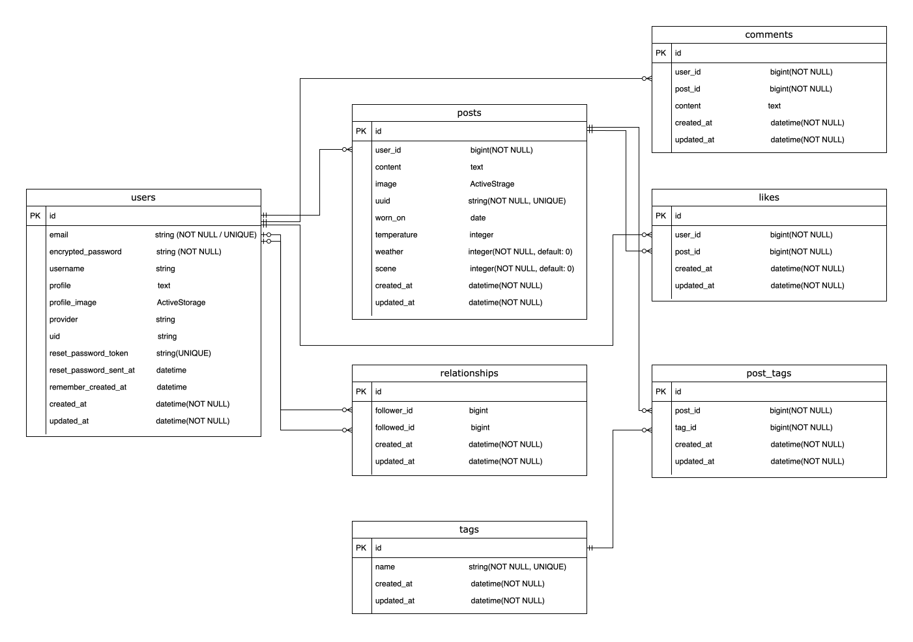

# Stylog - コーデを記録して振り返るファッションアプリ

## 📱 サービス概要

Stylogは、日々のコーディネートを記録・共有できるアプリです。

写真1枚と簡単なテキストで投稿できるシンプルな設計により、
日常的にコーデを記録しやすくしています。

また、投稿されたコーデを通じて他ユーザーのスタイルを参考にし、
新しいファッションの発見につなげることができます。

---

## 🌐 デモ

[Stylog デモサイト](https://graduation-project-mjhg.onrender.com)

テストアカウント
- email: test@example.com
- password: password

---

## 🎯 開発背景

既存サービスでは、
投稿のために多くの入力が必要だったり、
「見せる前提」のSNSになっていることで、
日常的な記録としては使いづらいと感じていました。

そこで、「写真1枚＋ひとこと」で気軽に投稿でき、
日々の服装を記録として振り返ることができるアプリを開発しました。

単なるSNSではなく、「記録」と「振り返り」を通じて
ユーザーの服選びをサポートするサービスを目指しています。

---

## 💡 工夫した点 / 差別化

- 投稿のハードルを下げるシンプルなUI設計
- 着用日・気温・天気・シーンを記録し、過去のコーデを振り返りやすくした設計
- タグをクリックすると、同じタグが付いた投稿を一覧で確認できる設計
- LPを設計し、初見でもサービスの価値が伝わる構成にした点
- 投稿フォームでは画像プレビューを表示し、投稿前に見た目を確認できるUXを意識
- Masonryレイアウトを採用し、ファッションアプリとして画像を探しやすいUIを設計

---

### UI・アクセシビリティの改善

トップページには、Stylogの特徴を伝えるチップを追加しました。

- 写真でコーデ記録
- 天気や気温もメモ
- タグで振り返り
- シーンも記録

これにより、初めて訪れたユーザーにも、Stylogでできることが伝わりやすくなるようにしました。

投稿詳細ページでは、情報を「タグ」「本文」「コーデ情報」「コメント」に分けて表示しています。着用日・気温・天気・シーンを「コーデ情報」としてまとめ、投稿内容を確認しやすくしました。

また、画像にalt属性を追加し、コメントが0件の場合には「まだコメントはありません」と案内文を表示しています。

これらの改善はViewとCSSを中心に行い、Controller・Model・DBに影響を与えないよう、変更範囲を限定しました。

---

## 🛠 技術スタック

| 種別 | 技術 |
|------|------|
| Frontend | ERB / Bootstrap / Sass |
| JavaScript | esbuild / Stimulus |
| Backend | Ruby 3.3 / Rails 7.1 |
| DB | PostgreSQL 16 |
| 認証 | Devise / OmniAuth (Google) |
| 画像管理 | Active Storage / Amazon S3 |
| 画像処理 | MiniMagick |
| テスト | RSpec / FactoryBot |
| 静的解析 | RuboCop |
| CI | GitHub Actions（RSpec自動実行） |
| 環境構築 | Docker |
| デプロイ | Render |

---

## 📌 実装機能

- ユーザー登録 / ログイン
- Google OAuthログイン
- 投稿（画像・テキスト・タグ）
- いいね機能
- コメント機能
- フォロー / アンフォロー機能
- タグによる投稿の絞り込み
- ユーザーページ（投稿一覧）
- コーデ情報の記録（着用日 / 気温 / 天気 / シーン）

---

## 🚀 開発環境構築

```bash
git clone https://github.com/blizzard115/graduation-project.git
cd graduation-project

docker compose build
docker compose up
docker compose exec web bin/rails db:create db:migrate
```

## 🏗 設計の工夫

### 1️⃣ 公開IDにUUIDを採用

データベース内部では主キーとして`bigint`型のIDを使用し、投稿の公開URLにはUUIDを使用しています。

これにより、URLから連番IDを推測されにくい設計にしています。

```ruby
def to_param
  uuid
end
```

### 2️⃣ フォロー機能の自己参照設計
```ruby
has_many :active_relationships,
         class_name: 'Relationship',
         foreign_key: :follower_id,
         dependent: :destroy

has_many :passive_relationships,
         class_name: 'Relationship',
         foreign_key: :followed_id,
         dependent: :destroy
```

### 3️⃣ N+1問題対策

投稿一覧では、ユーザー情報・いいね・タグ・画像を同時表示するため、
includesを利用してN+1問題を回避しています。

### 4️⃣ 責務分離
 - before_actionで共通処理整理
 - Strong Parameters徹底
 - モデルへロジックを集約

### 5️⃣ テスト設計
 - request specによる認証・権限制御の確認
 - system specによる投稿フロー確認
 - FactoryBotを利用したテストデータ生成
 - Docker環境で実行
 - GitHub ActionsによるCI連携

### 6️⃣ 画像処理

ActiveStorage + MiniMagick を使用し
投稿画像は用途ごとに variant を生成しています。

- 一覧表示：軽量サムネイル
- 詳細表示：高解像度画像

画像サイズを最適化することでページ表示速度を改善しています。

### 7️⃣ セキュリティ対策

- Strong Parametersによる受信パラメータの制限
- Deviseによる認証管理
- 投稿者本人以外による編集・削除を防ぐ認可処理
- 投稿URLにUUIDを使用し、連番IDを公開しない設計

## 🗄 データベース設計

### 画面遷移図
[Figmaで画面遷移図を見る](https://www.figma.com/design/MOaiD71mhWoOIQzpAOrrDl/%E5%8D%92%E6%A5%AD%E5%88%B6%E4%BD%9C?node-id=0-1&t=UyLnZ2JTuP0qgDMV-1)

### ER図



---

## ✅ テスト・静的解析

### 🧪 テスト実行
```bash
docker compose exec web bundle exec rspec
```

### 🧹 静的解析
```bash
docker compose exec web bundle exec rubocop
```

## 📷 画面イメージ

### 投稿一覧


### 投稿詳細


### ユーザーページ


---

## 🚀 今後の展望

- 気温・天気・シーンによる投稿の絞り込み機能
- 天気APIと連携した気温・天気の自動入力
- 動的OGPによるSNSシェア機能の強化

蓄積された着用日・気温・天気・シーンの情報を活用し、
将来的には状況に合った過去のコーデを探しやすくする機能や、
コーデ提案機能へ発展させたいと考えています。
